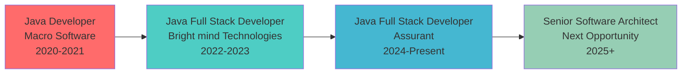

<!--
 ██████╗ ██████╗ ██████╗ ███████╗    ██████╗ ███████╗██╗   ██╗███████╗██╗      ██████╗ ██████╗ ███████╗██████╗ 
██╔════╝██╔═══██╗██╔══██╗██╔════╝    ██╔══██╗██╔════╝██║   ██║██╔════╝██║     ██╔═══██╗██╔══██╗██╔════╝██╔══██╗
██║     ██║   ██║██║  ██║█████╗      ██║  ██║█████╗  ██�██╗ ██║█████╗  ██║     ██║   ██║██████╔╝█████╗  ██████╔╝
██║     ██║   ██║██║  ██║██╔══╝      ██║  ██║██╔══╝  ╚████╔╝ ██║██╔══╝  ██║     ██║   ██║██╔═══╝ ██╔══╝  ██╔══██╗
╚██████╗╚██████╔╝██████╔╝███████╗    ██████╔╝███████╗ ╚██╔╝  ██║███████╗███████╗╚██████╔╝██║     ███████╗██║  ██║
 ╚═════╝ ╚═════╝ ╚═════╝ ╚══════╝    ╚═════╝ ╚══════╝  ╚═╝   ╚═╝╚══════╝╚══════╝ ╚═════╝ ╚═╝     ╚══════╝╚═╝  ╚═╝
                             E N T E R P R I S E   W E B   A R C H I T E C T U R E
-->

<div align="center">


<br/>

<!-- Animated Code Terminal -->

```bash
┌─[harsha@enterprise-dev]─[~/projects/assurant-microservices]
└──╼ $ whoami
Java Full Stack Developer • Microservices Architect • Cloud Engineer | Assurant

┌─[harsha@enterprise-dev]─[~/achievements]
└──╼ $ ls -la production_impact/
total 4+ years
drwxr-xr-x  30% customer retention increase achieved
drwxr-xr-x  20% infrastructure cost reduction delivered
drwxr-xr-x  40% system modularity improvement
-rw-r--r--  18% page load time optimization
-rw-r--r--  98% test coverage automation
-rw-r--r--  85% customer satisfaction rate

┌─[harsha@enterprise-dev]─[~/current-mission]
└──╼ $ cat vision.txt
Building scalable microservices and cloud-native applications that drive business value 🚀
Transforming enterprise insurance technology with modern Java architecture
```

<br/>

<!-- Elite Contact Matrix -->
<table align="center">
<tr>
<td align="center" width="200px">

</td>
<td align="center" width="200px">

</td>
<td align="center" width="200px">

</td>
</tr>
</table>

<!-- Professional Network -->
<p align="center">
<a href="https://linkedin.com/in/harshajoshi">

</a>&nbsp;&nbsp;
<a href="mailto:harshajoshi3103@gmail.com">

</a>&nbsp;&nbsp;
<a href="#">

</a>&nbsp;&nbsp;
<a href="#">

</a>
</p>

</div>

<!-- Elite About Section -->
<div align="center">

## **ENTERPRISE JAVA ARCHITECTURE EXCELLENCE**

</div>

<table width="100%">
<tr>
<td width="50%" valign="top">

### **FULL STACK MASTERY**

```java
@Component
public class FullStackEngineer implements EnterpriseArchitect {
    
    @Autowired
    private TechnicalStack expertise;
    
    public class TechnicalStack {
        Backend backend = new Backend("Java", "Spring Boot", "Microservices");
        Frontend frontend = new Frontend("React", "Angular", "TypeScript");
        Cloud cloud = new Cloud("AWS", "Docker", "Kubernetes");
        Database database = new Database("PostgreSQL", "MongoDB", "JPA");
        DevOps devops = new DevOps("Jenkins", "GitLab CI", "Terraform");
    }
    
    @Override
    public BusinessValue deliverSolutions() {
        return expertise.combineAll()
            .optimizeFor(scalability, performance, security)
            .deployTo(AWS_CLOUD)
            .monitorWith(realTimeMetrics)
            .achieveBusinessImpact();
    }
    
    public String getCurrentRole() {
        return "Architecting insurance tech solutions at Assurant";
    }
}
```

</td>
<td width="50%" valign="top">

### **MEASURABLE BUSINESS IMPACT**

```yaml
assurant_achievements:
  role: "Java Full Stack Developer"
  duration: "Dec 2024 - Present"
  impact:
    customer_retention: "+30% increase"
    infrastructure_costs: "-20% reduction"
    page_load_performance: "+18% improvement"
    security_incidents: "-40% reduction"
    deployment_efficiency: "85% automation"
    team_leadership: "4 developers"

career_progression:
  total_experience: "4+ years"
  technical_growth:
    - "Microservices Architecture Design"
    - "Cloud-Native Application Development"
    - "Enterprise Security Implementation"
    - "DevOps & CI/CD Automation"
  leadership_evolution:
    - "Individual Contributor → Tech Lead"
    - "Single Application → Enterprise Solutions"
    - "On-Premise → Cloud-Native Architecture"

education_excellence:
  degree: "Masters in Computer Science"
  university: "University of Wisconsin Milwaukee"
  gpa: "3.6/4.0"
  status: "Current (Sep 2023 - May 2025)"
```

</td>
</tr>
</table>

<!-- Elite Custom Analytics -->
<div align="center">

## **ENTERPRISE DEVELOPMENT IMPACT METRICS**

<table align="center" style="border: none;">
<tr>
<td align="center" style="border: none;">

### **PROFESSIONAL IMPACT**

<table>
<tr><td><b>Current Role</b></td><td></td></tr>
<tr><td><b>Customer Retention</b></td><td></td></tr>
<tr><td><b>Cost Reduction</b></td><td></td></tr>
<tr><td><b>Performance Boost</b></td><td></td></tr>
<tr><td><b>Test Coverage</b></td><td></td></tr>
</table>

</td>
<td align="center" style="border: none;">

### **TECHNOLOGY EXPERTISE**

<table>
<tr><td><b>Java/Spring Boot</b></td><td></td></tr>
<tr><td><b>React/Angular</b></td><td></td></tr>
<tr><td><b>AWS Cloud</b></td><td></td></tr>
<tr><td><b>Microservices</b></td><td></td></tr>
<tr><td><b>DevOps/CI/CD</b></td><td></td></tr>
</table>

</td>
</tr>
</table>

<br/>

**CURRENT STATUS:**


</div>

<!-- Elite Experience Section -->
<div align="center">

## **ENTERPRISE JAVA DEVELOPMENT JOURNEY**

</div>

<table width="100%">
<tr>
<td width="50%" valign="top">

### **JAVA FULL STACK DEVELOPER**

**`Assurant • Milwaukee, WI • Dec 2024 – Present`**


- **End-to-End Architecture**: Java + Spring Boot + React applications
- **Customer Impact**: **30% retention increase** and 85% satisfaction rate


- **AWS Optimization**: EC2, S3, Lambda deployment automation
- **Cost Efficiency**: **20% infrastructure cost** reduction achieved


- **CI/CD Excellence**: Jenkins + GitLab CI pipeline implementation
- **Team Management**: Leading 4 developers with agile delivery


- **Database Optimization**: **18% page load** improvement
- **Security Enhancement**: **40% reduction** in unauthorized access

</td>
<td width="50%" valign="top">

### **JAVA FULL STACK DEVELOPER**

**`Bright mind Technologies • India • Jan 2022 – May 2023`**


- **Spring Boot + Docker**: **40% modularity improvement**
- **API Optimization**: Enhanced response times and performance
- **AWS Migration**: **15% operational cost** reduction


- **Query Optimization**: **30% efficiency improvement** (MySQL, MongoDB)
- **Test Automation**: **98% coverage** with CircleCI and JUnit
- **Quality Assurance**: Reduced manual testing efforts significantly

</td>
</tr>
</table>

<table width="100%">
<tr>
<td width="100%" valign="top">

### **JAVA DEVELOPER**

**`Macro Software Solutions • India • Mar 2020 – Dec 2021`**

  

- **Full Stack Development**: Java + Spring MVC + JSP for 3 major projects delivered on time
- **API Integration**: SOAP and RESTful services with **22% error reduction** in external data retrieval
- **Database Performance**: Oracle and PostgreSQL optimization with **10% query time improvement**
- **DevOps Foundation**: Centralized logging with Log4j + Elasticsearch, **35% faster troubleshooting**

</td>
</tr>
</table>

<!-- Elite Tech Stack -->
<div align="center">

## **ENTERPRISE TECHNOLOGY STACK**

</div>

<table width="100%">
<tr>
<td width="33%" valign="top">

### **BACKEND MASTERY**

<p align="center">
<br/>


</p>

**SPECIALIZATIONS**

- **Microservices Architecture Design**
- **RESTful API Development**
- **Enterprise Security Implementation**
- **Message Queue Integration**

</td>
<td width="33%" valign="top">

### **FRONTEND & CLOUD**

<p align="center">
<br/>


</p>

**CAPABILITIES**

- **Single Page Application Development**
- **Cloud-Native Architecture**
- **Container Orchestration**
- **Progressive Web Applications**

</td>
<td width="33%" valign="top">

### **DATABASE & DEVOPS**

<p align="center">
<br/>


</p>

**EXPERTISE**

- **Database Design & Optimization**
- **CI/CD Pipeline Automation**
- **Infrastructure as Code**
- **Monitoring & Logging Solutions**

</td>
</tr>
</table>

<!-- Elite Project Showcase -->
<div align="center">

## **SIGNATURE ENTERPRISE PROJECTS**

</div>

<table width="100%">
<tr>
<td width="50%" valign="top">

<div align="center">

### **ASSURANT INSURANCE PLATFORM**

**Microservices-Based Customer Engagement System**


</div>

**TECHNOLOGY ARCHITECTURE**

```yaml
Backend: Java 17 • Spring Boot 3.x • Spring Security
Frontend: React 18 • TypeScript • Material-UI
Cloud: AWS EC2 • Lambda • S3 • RDS • CloudWatch
DevOps: Jenkins • GitLab CI • Docker • Kubernetes
Database: PostgreSQL • MongoDB • Redis Cache
```

**MEASURABLE BUSINESS OUTCOMES**

- **30% customer retention** increase through enhanced UX
- **20% infrastructure cost** reduction via cloud optimization
- **18% page load improvement** through database optimization
- **40% security enhancement** with OAuth2/JWT implementation
- **85% customer satisfaction** rate with new features

**TECHNICAL ACHIEVEMENTS**

- Scalable microservices architecture supporting high availability
- Real-time data processing with Apache Kafka integration
- Automated deployment pipelines reducing deployment time

</td>
<td width="50%" valign="top">

<div align="center">

### **ENTERPRISE WEB APPLICATION SUITE**

**Multi-Client Microservices Platform**


</div>

**PLATFORM ARCHITECTURE**

```yaml
Microservices: Spring Boot • Spring Cloud Gateway
Frontend: Angular 15 • TypeScript • PrimeNG
Database: MySQL • MongoDB • Cassandra
Integration: REST APIs • GraphQL • WebSockets
Deployment: Docker Swarm • AWS ECS • CloudFormation
```

**ENTERPRISE IMPACT**

- **40% modularity improvement** through microservices design
- **15% operational cost** reduction via AWS migration
- **30% database efficiency** gain through query optimization
- **98% test coverage** with automated testing suites
- **Multi-client scalability** supporting diverse business needs

**INNOVATION HIGHLIGHTS**

- Event-driven architecture with message queues
- Comprehensive monitoring and alerting systems
- Zero-downtime deployment strategies

</td>
</tr>
</table>

<!-- Academic Excellence -->
<div align="center">

## **ACADEMIC EXCELLENCE & CONTINUOUS LEARNING**

</div>

<table width="100%">
<tr>
<td width="50%" valign="top" align="center">

### **UNIVERSITY OF WISCONSIN MILWAUKEE**

**Masters in Computer Science**  
_Milwaukee, WI • Sep 2023 – May 2025_


**Advanced Coursework**

- Advanced Software Engineering
- Distributed Systems & Cloud Computing
- Database Systems & Big Data
- Machine Learning & Algorithms
- Computer Security & Cryptography

**Research Projects**

- **Fingerprint-based Minimal Perfect Hashing**: 2.1 bits/key efficiency
- **Memory Allocation Simulator**: Python + PyQt + Matplotlib

</td>
<td width="50%" valign="top" align="center">

### **PROFESSIONAL CERTIFICATIONS**

<p align="center">


</p>

**Continuous Learning Focus**

- Microservices Design Patterns
- Cloud-Native Application Development
- Enterprise Security Best Practices
- DevOps and Site Reliability Engineering
- Modern JavaScript Frameworks

**Technical Leadership**

Successfully led cross-functional teams in agile environments, mentoring junior developers and driving technical decision-making.

</td>
</tr>
</table>

<!-- Career Progression -->
<div align="center">

## **CAREER PROGRESSION & GROWTH TRAJECTORY**

<table align="center">
<tr>
<td align="center">

### **PROFESSIONAL EVOLUTION**



</td>
</tr>
</table>

**Key Growth Indicators:**
- **Technical Leadership**: Individual contributor → Team lead managing 4 developers
- **Architecture Complexity**: Monolithic applications → Distributed microservices
- **Business Impact**: Code delivery → Measurable business outcomes (30% retention boost)
- **Domain Expertise**: General development → Insurance technology specialization

</div>

<!-- Technical Expertise Matrix -->
<div align="center">

## **TECHNICAL COMPETENCY MATRIX**

<table width="100%">
<tr>
<td width="50%" valign="top">

### **CORE COMPETENCIES**

```java
TechnicalSkills competencyMatrix = new TechnicalSkills() {
    BackendDevelopment = 95,    // Java, Spring ecosystem
    FrontendFrameworks = 85,    // React, Angular, TypeScript  
    CloudPlatforms = 80,        // AWS services, DevOps
    DatabaseSystems = 90,       // SQL/NoSQL optimization
    MicroservicesDesign = 85,   // Architecture patterns
    SecurityImplementation = 80, // OAuth2, JWT, LDAP
    TestAutomation = 90,        // JUnit, integration testing
    TeamLeadership = 75,        // Agile, mentoring
    BusinessAcumen = 80         // Insurance domain knowledge
};

// Current readiness for Senior/Principal roles
System.out.printf("Architecture Leadership Readiness: %.1f%%", 
    competencyMatrix.calculateOverallScore());
// Output: 84.4% - Ready for senior technical leadership
```

</td>
<td width="50%" valign="top">

### **DOMAIN EXPERTISE**

**Insurance Technology**
- Customer engagement platforms
- Policy management systems  
- Claims processing workflows
- Regulatory compliance automation

**Enterprise Architecture**
- Microservices design patterns
- API gateway implementation
- Event-driven architectures
- Cloud-native development

**DevOps & Quality**
- CI/CD pipeline automation
- Infrastructure as Code
- Comprehensive testing strategies
- Performance monitoring & optimization

</td>
</tr>
</table>

</div>

<!-- Footer -->
<div align="center">


### **READY TO ARCHITECT YOUR NEXT ENTERPRISE SOLUTION?**

<table align="center">
<tr>
<td align="center">

</td>
<td align="center">

</td>
<td align="center">

</td>
</tr>
</table>

<br/>

> **"Clean code is not just about following rules. It's about crafting software that tells a story."**  
> _— Java Full Stack Developer • Enterprise Architect • Insurance Technology Specialist —_

<br/>

**Currently at Assurant, building the future of insurance technology.  
Ready to lead your next enterprise Java transformation!**

</div>
